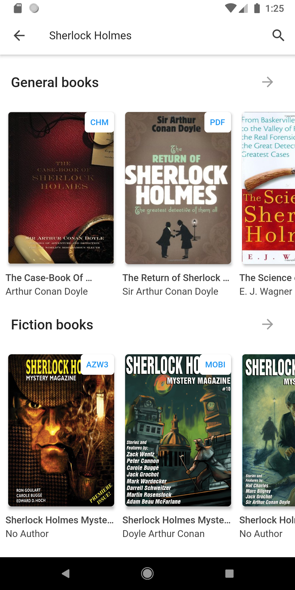

<h1 align="center">Librebook</h1>
<h4 align="center">A minimal front-end library genesis client, built by Flutter</h4>

  
  
  
  

## Description
Librebook is an open-source front-end application to help the users download the book easily from library genesis.

## Features
- [x] General book download
- [x] Fantasy book download
- [x] IPFS download mirror
- [ ] Syncronize scraper settings (on progress)
- [ ] Change download location (on progress)
- [ ] Search history (on progress)

## Screenshots
<table>
  <tr>
    <td></td>
    <td></td>
    <td></td>
  </tr> 
</table>

## Download
You can download Librebook from [Codemagic](https://codemagic.io/apps/6003d2461b08f3ec61b49785/6003d2461b08f3ec61b49784/latest_build) by downloading **app-release.apk**. You also can download Librebook from [release page](https://github.com/bagaswastu/librebook/releases/) as well.

## Contributing
Any contributions you make are **greatly appreciated**. However, for major changes, please open an issue first to discuss what you would like to change.

You can add localizations by creating a json file in `lang/[LANGUAGE_CODE].json` and adding the language to `supportedLocales` in [`lib/main.dart`](https://github.com/bagaswastu/librebook/blob/master/lib/main.dart#L31) and [`lib/app_localizations.dart`](https://github.com/bagaswastu/librebook/blob/master/lib/app_localizations.dart#L40)

## License
Distributed under the MIT License. See [LICENSE](LICENSE) for more information.
